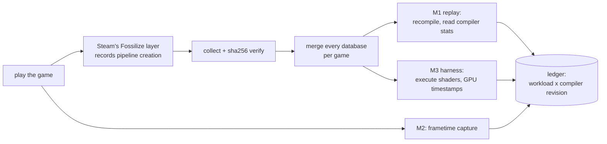
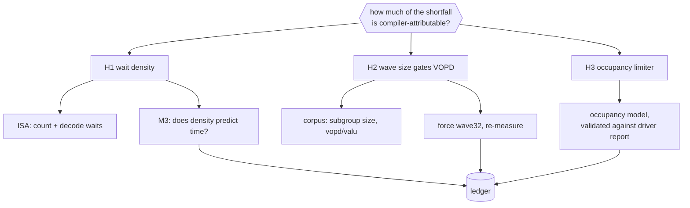

# Methodology — the research method

The pre-answer to §1.1 (Objetivos), §1.3 (Escopo e limitações), §2 (Metodologia)
and §3 (Resultados esperados) of the pre-project. Justification is in
[PREMISE.md](PREMISE.md); the mechanism of each instrument is in
[../DOMAIN.md](../DOMAIN.md); evidence rules are in
[RESEARCH_GUIDELINES.md](RESEARCH_GUIDELINES.md).

**This file is written to be argued with.** Every hypothesis carries a
falsification criterion, and the protocol is numbered so a step can be replaced
without renumbering everything downstream.

---

## 1. Research question

> On RDNA3, which characteristics of a shader workload and of the compiler's
> output determine how much of the architecture's specified throughput is
> actually reached — and how much of the difference is attributable to decisions
> the compiler makes rather than to the hardware itself?

The question is **investigative, not confirmatory**. It admits "none of it" as a
legitimate answer, and that answer would itself be a result: it would relocate
the explanation from software to architecture.

## 2. Objectives

**General.** Characterize the performance behaviour of the AMD RDNA3
architecture at the compiler and machine-code level, over shader workloads
extracted from real games, using a reproducible and independently validated
measurement bench.

**Specific** — every one is a measurement commitment, deliverable regardless of
what the numbers turn out to be:

1. Quantify the density of compiler-inserted wait instructions (`S_DELAY_ALU`)
   in the final machine code, and its distribution across workload classes.
2. Measure the wave-size selection policy actually applied to real shaders, and
   the resulting dual-issue (VOPD) capture rate.
3. Evaluate which resource limits occupancy per shader (VGPR, SGPR, LDS,
   scratch) and how much headroom separates each shader from the next occupancy
   step.
4. Build and validate a bench that isolates the compiler as an experimental
   variable, proving its own null result before any non-null one is claimed.
5. Measure the effect of controlled compiler configuration changes on emitted
   code, on GPU execution time, and on in-game frame rate.
6. Relate the above to a documented taxonomy of workloads, and report which
   relationships hold and which do not.

## 3. Hypotheses

Each hypothesis states what would refute it. A hypothesis that cannot be refuted
by any obtainable measurement is removed from this file rather than defended.

### H1 — the cost of compiler-managed issue distance

*Compiler-inserted `S_DELAY_ALU` waits account for a measurable share of
execution cost, and that share varies systematically with workload character.*

- **Measured by:** `S_DELAY_ALU` density and decoded wait distance from final
  assembly (M1/ISA), regressed against measured per-shader GPU time (M3).
- **Refuted if:** wait density shows no relationship with measured time once
  shader size and memory intensity are controlled — i.e. the waits are absorbed
  by stalls the shader was already paying.
- **Why it can be tested at all:** ISA §16.5 states the instruction is optional
  for correctness, so removing or shortening waits cannot corrupt results — the
  penalty is throughput. That makes it a safe experimental surface.
- **Status:** the counting instrument exists and was verified against an
  independent grep on one shader. **No cost has been measured.** A count is not
  a cost.

### H2 — dual-issue is gated by wave-size policy, not by pair-finding

*Low VOPD capture is a consequence of the driver defaulting to wave64, in which
the VOPD encoding is illegal by hardware rule, rather than of the compiler
failing to find dual-issuable pairs.*

- **Measured by:** `subgroup_size` distribution and `vopd/valu` ratio across the
  corpus, grouped by stage and API; then re-measured with wave32 forced.
- **Refuted if:** forcing wave32 does not raise VOPD capture substantially, or
  raises it without any change in measured time — the second case would keep the
  mechanism but demolish its relevance.
- **Supporting evidence already in hand:** `radv_physical_device.c:2505-2529`
  sets wave64 as the default for compute, pixel and geometry stages on GFX10+,
  with wave32 reachable only via `RADV_PERFTEST`; ISA §7.6 makes VOPD wave32-only.
  A corpus measurement on one title is consistent with both.
- **Status:** ⚠️ **n = 1 game.** Not generalizable until the corpus replay runs
  across several titles grouped by API and workload class.

### H3 — occupancy pressure conditions who can benefit

*The resource that limits occupancy (VGPR, SGPR, LDS, scratch) determines
whether a given compiler change helps a given shader at all.*

- **Measured by:** a per-shader occupancy model built from the gfx1101 resource
  limits in the ISA reference, attributing the binding constraint and the
  headroom to the next occupancy step.
- **Refuted if:** shaders respond to compiler changes independently of their
  limiter — which would mean the attribution carries no information and should
  be reported as such.
- **Self-check that makes it trustworthy:** the modelled occupancy must equal the
  driver-reported value for every row. Any mismatch means the hardware model is
  wrong, and it must be fixed before any occupancy claim is published. This check
  is free and catches exactly the class of error that would silently invalidate a
  chapter.
- **Status:** the input column is collected; the model does not exist yet.

## 4. Variables

| role | variable | how it is set or read |
|---|---|---|
| **Independent** | wave-size policy | `RADV_PERFTEST=cswave32,pswave32,gewave32` — one configuration file, no compiler change |
| **Independent** | compiler revision | git revision of the ACO overlay; changes exactly when the compiler does |
| **Independent** *(secondary)* | shader clock | `power_dpm_force_performance_level`, `pp_dpm_sclk` |
| **Dependent** | emitted-code metrics | VGPR/SGPR, spills, occupancy, `vopd/valu`, wait density, code size, compile time |
| **Dependent** | GPU execution cost | per-shader time from GPU timestamp queries, isolated dispatch |
| **Dependent** | delivered performance | frame rate and frametime percentiles in-game |
| **Controlled** | GPU, OS, driver build, shader corpus, cache state, thread count | one machine; identical input; caches disabled and isolated per run; drivers alternated at batch granularity so thermal drift hits both sides |
| **Explicitly not measured** | cross-generation gain | **cited from external reviews as a premise.** No RDNA2 hardware is available and no gen-over-gen delta is claimed as this work's own measurement. |

The last row is the single most important line in this file. Cohort labels
(`high-gain` / `low-gain`) are **external evidence with a recorded source, date,
resolution, settings and driver version** — never a number this work produced.

## 5. Instruments

Three independent measurements of the same change, joined by one ledger keyed on
(workload × compiler revision). Mechanism in [../DOMAIN.md](../DOMAIN.md).

| | measures | deterministic | needs the game running |
|---|---|---|---|
| **M1 — static** | what the compiler emitted | yes | no |
| **M3 — isolated execution** | what that code costs the GPU | yes | no |
| **M2 — in-game** | what the player receives | no | yes |

Reading across a ledger row is the point: a static win with no execution win says
the metric optimised was not the cost; an execution win with no frame win says
the shader is not hot enough to matter. **All three are publishable outcomes**,
and the third is what a single-metric study would have wrongly called a success.





### 5.1 The Two Experimental Arms

The methodology is organized into two mutually reinforcing arms:

```
┌─────────────────────────────────────────────────────────────────────────────┐
│                           THE TWO EXPERIMENTAL ARMS                         │
├──────────────────────────────────────┬──────────────────────────────────────┤
│ ARM 1: Production Game Corpus (.foz) │ ARM 2: Directed Microbenchmarking &  │
│                                      │        Compiler Architecture         │
├──────────────────────────────────────┼──────────────────────────────────────┤
│ • Input: Real SPIR-V shaders from    │ • Input: Synthetic Vulkan/SPIR-V     │
│   commercial games (Fossilize .foz)  │   microbenchmarks with precise math  │
│ • Metrics: M1 static, M2 in-game,    │ • Metrics: Nanosecond ALU latencies, │
│   M3 isolated shader execution       │   stall cycle curves, occupancy steps│
│ • Goal: Macro-level characterization │ • Goal: Micro-level isolation of     │
│   over production code (18+ titles)  │   hardware limits vs compiler errors │
│ • Surface: Wave size policy, corpus  │ • Surface: ACO vs LLVM AMDGPU,       │
│   mining, ledger correlation         │   pre- vs post-RA passes, bank rules │
└──────────────────────────────────────┴──────────────────────────────────────┘
```

1. **Arm 1 (.foz / Production Corpus):** Captures real-world workloads across
   native Vulkan and D3D12/VKD3D titles. Provides the empirical dataset to test
   whether compiler optimizations actually matter in production games. Replays
   through M1 (static metrics), M2 (game frametimes), and M3 (shaderbench for
   native Vulkan) into the unified ledger.
2. **Arm 2 (Directed Microbenchmarking & Compiler Architecture):** Builds
   targeted synthetic shaders that systematically vary:
   - Dependency distance (1 to 8+ VALU instructions) with and without `S_DELAY_ALU`
     hints to map hardware stall curves.
   - VGPR bank collision patterns to measure the latency cost of unaligned VOPD pairs.
   - Stepwise VGPR allocations across 24-register boundaries (24 to 264 VGPRs)
     to map real SIMD occupancy cliff behavior.
   - Comparative compiler pass inspection: Mesa ACO (`aco_insert_delay_alu.cpp`,
     `aco_scheduler_ilp.cpp`) versus AMD LLVM backend (`AMDGPUInsertDelayAlu.cpp`).

The full, source-verified plan for each arm now lives in its own document:
[ARM1_CORPUS.md](ARM1_CORPUS.md) and [ARM2_COMPILER.md](ARM2_COMPILER.md).

## 6. Protocol

Nine steps. **The cronograma references these numbers**, so they are stable
identifiers: replace a step's content if the method changes, but do not renumber.

1. **Bibliographic review and specification study.** Systematic reading of the
   RDNA2 and RDNA3 ISA references, contrasting how each generation resolves
   instruction dependencies; review of prior art on compiler-managed versus
   hardware-managed scheduling and on GPU characterization by microbenchmarking.
   Produces the theoretical grounding and the reference base.
2. **Corpus construction.** Extract the shaders that real games compile, without
   instrumenting the games: the platform's own pipeline-caching layer records
   every pipeline created during play. Copy out with cryptographic verification,
   merge per title, and record provenance for every record — distinguishing what
   this machine compiled from what was downloaded.
3. **Static instrumentation.** Recompile the corpus through the driver under
   study and collect, per pipeline stage, the compiler's own report: register
   allocation, spills, occupancy, instruction mix, dual-issue count, wave size
   and compilation time. Disassemble the highest-ranked shaders to final machine
   code and classify their instructions.
4. **Validation by null test.** Compare a compiler against an unmodified copy of
   itself over identical input. **The result must be zero.** This is the control
   experiment: it proves the capture → recompile → parse → join chain does not
   itself manufacture differences, and nothing measured afterwards is trusted
   until it passes. Repeated for each instrument.
5. **Isolated execution measurement.** Execute the real shaders standalone under
   a fixed synthetic load, timed with GPU timestamp queries, under process
   isolation with fault detection — a compiler experiment can fault the device,
   and a fault must be recorded as an outcome rather than lost as a crash. Every
   shader appears in the output with a status, because a shrinking denominator
   would otherwise look like an improvement.
6. **In-game measurement.** Capture frame times during built-in benchmarks or
   scripted scenes, reporting average and low percentiles. Noisy and slow, but it
   is the only measurement of what the user receives.
7. **Controlled experiments.** Manipulate one variable at a time. First the
   wave-size policy, which requires no compiler change and is therefore the
   cheapest real independent variable available; then targeted compiler
   modifications, each measured through all three instruments. Instability
   produced by an aggressive modification is recorded as a result — it measures
   how much margin the compiler was leaving.
8. **Characterization and correlation.** Classify workloads by measured
   character (ALU-bound, memory-bound, branch-heavy, register-starved) using
   thresholds calibrated on the corpus distribution and recorded per run, then
   test whether different classes respond differently to the same change. If they
   do not, the taxonomy carries no information and that is reported.
9. **Statistical analysis and writing.** Effect sizes with confidence intervals
   rather than significance stars; correction for multiple comparisons across the
   metric family; and clustered inference, because per-shader rows nested inside a
   handful of games are not independent samples — for any game-level claim the
   effective sample size is the number of games, not the number of shaders.

## 7. Expected results

The study is investigative, so the contribution is **understanding**, and the
outcome space is stated in advance rather than a single result being promised.
Three outcomes are possible and all three answer the research question:

**(a) No recoverable gain, with an architectural explanation.** Compiler changes
produce no measurable improvement, and the measurements explain why — for
instance, the waits fall on paths already stalled on memory, or occupancy limits
bind before instruction scheduling matters. This attributes the shortfall to the
architecture rather than to software and closes the compiler as an avenue with
evidence.

**(b) A gain, conditioned on workload class, possibly with instability.**
Specific modifications yield an improvement on some workloads and not others —
for example, benefiting compute-bound shaders while harming or destabilizing
others. The conditioning is the finding: it identifies which workload characteristics
determine whether compiler headroom exists, and the instability boundary
quantifies how much margin the stock compiler was holding in reserve.

**(c) No gain and no single cause, but a better account of the compiler.** Even
without an improvement, the characterization explains the compiler's actual
behaviour and the reasoning behind its design choices — why wave64 is the default
policy, why dual-issue is rarely reachable, why the pairing rules are hard to
satisfy — grounded in measurement instead of speculation.

**Delivered regardless of which outcome occurs:**

- a characterization of RDNA3's compiler-managed scheduling over real workloads,
  rather than over synthetic kernels;
- a reproducible method and an open bench that validates itself before it is
  believed, reusable for later architectures;
- a documented set of negative results and scope limits, which is normally the
  part that never gets written down.

## 8. Scope and limitations

Stated up front because the pre-project instructions require it, and because
every one of them is a question that will otherwise be asked at the defense.

**Scope.** One GPU of the RDNA3 family; one open-source driver and compiler
stack on Linux; shader workloads from a set of commercially released games plus
synthetic benchmarks; analysis at the level of the compiler's output and the
final machine code.

**Limitations.**

1. **No RDNA2 hardware.** No cross-generation measurement is performed. The
   generational gap is a cited premise, not a result of this work.
2. **Synthetic inputs are not scene inputs.** Isolated execution supplies
   inputs the recorded data never contained, so cache behaviour and branch
   divergence are not those of the real frame. Only the *relative* difference
   between two compilers on the same shader is defensible; the absolute time is
   not the game's time.
3. **Pipeline creation is not pipeline use.** The capture records that a shader
   was compiled, never that it was drawn. Frame capture is the only ground truth
   for what was on screen, and any claim about scene hotness needs it.
4. **A static count is not a cost.** More instructions does not mean slower.
5. **Isolated execution does not cover translated D3D12 titles.** Shaders
   translated from D3D12 read raw pointers and their offsets from the same
   buffers, so no synthetic fill makes both valid — measured, not assumed. Those
   titles remain covered by the static and in-game measurements. This is a
   finding to report, not a gap to hide.
6. **One machine, one driver stack, one operating system.** Results describe this
   configuration. Generalization to the proprietary driver or to other operating
   systems is not claimed.
7. **Time and equipment.** Two academic semesters, one workstation, and a
   dependency on the advisor's availability for review. Any step requiring
   hardware that is not on hand is out of scope by construction.

## 9. Threats to validity

**Internal.** Compiler caches must be disabled and isolated per run, or an A/B
compares a warm run against a cold one. The driver that actually loaded must be
confirmed from the recorded environment, not assumed from configuration.
Thermal drift is handled by alternating compilers at batch granularity so both
sides absorb it equally. Pipeline creation collapses after first encounter, so a
capture taken during steady state records the leftovers rather than the hot set.

**Construct.** Wait density is a proxy for stall cost and must be validated
against measured time before it is used as one — a proxy that fails validation is
a finding, not something to bury. The shader-ranking score used to select
disassembly targets is uncalibrated: it chooses what to inspect, and must never
be presented as a severity measure.

**External.** One GPU, one driver, one OS, and games running through translation
layers whose overhead is part of every measurement.

**Statistical.** Testing many metrics across many titles will produce spurious
significance unless corrected. Per-shader rows are not independent observations.
With enough rows everything becomes significant and nothing becomes large, which
is why effect sizes with intervals are reported instead of p-values.

## 10. Infrastructure required

**Equipment.** A workstation with an RDNA3 GPU (available); approximately 60 GB
of storage for the shader corpus and session artifacts; no cloud service and no
external database.

**Software.** Linux; the open-source Vulkan driver and its shader compiler, built
locally in both an unmodified and a modifiable copy; the pipeline capture and
replay toolchain; a frametime capture overlay; a frame-capture tool; the vendor's
offline shader analyzer; the vendor's ISA reference documentation.

**Content.** A set of commercially released games covering both native and
translated graphics APIs, plus scriptable synthetic benchmarks — needed because
the workloads under study must be real ones.

**People.** Advisor availability for periodic review. No human subjects, no
external participants, no ethics approval required.

---

## Known problems, costs, and things I would flag

1. **Step 9's statistical layer is the least developed part of this method.**
   The other eight steps have working instruments; this one is a stated intention.
   It is also the step most likely to be attacked in a defense, because
   uncorrected multiple comparisons over a large metric family is a standard
   objection with a standard answer that must actually be implemented.
2. **H3 has no instrument yet.** H1 and H2 have measurements in hand; H3 has one
   collected column and a model that does not exist. Listing three hypotheses as
   if they were equally supported would misrepresent the state of the work.
3. **The workload taxonomy in step 8 is the pivot of the whole correlation and it
   is not defined yet.** "Which characteristics correlate with what" is
   unanswerable until workloads are characterized, and no thresholds have been
   calibrated. Until that exists, step 8 is a plan, not a method.
4. **The wave32 experiment is described as cheap, and it is — but its outcome may
   be uninteresting.** If forcing wave32 raises VOPD and changes nothing
   measurable, H2 survives mechanically while losing all practical relevance.
   That result must be reported as plainly as a positive one, and the temptation
   to keep searching for a framing where it looks important should be named now,
   while it is still cheap to resist.
5. **The protocol assumes the corpus is stable, but the platform deletes shader
   caches when a title is uninstalled.** Steps 3 through 8 all depend on data
   that step 2 must secure first, and part of it is currently unsecured. A
   methodology that silently depends on an unbacked-up input is fragile in a way
   no reader would detect.
